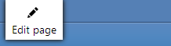

# Xperience Community: Page Edit Button

## Description

This package provides content editors with a button displayed on web channel pages, that allows them to quickly navigate to the right place in the Xperience by Kentico administration interface to edit the page.

**NOTE**: As mentioned in a [Q&A discussion](https://community.kentico.com/q-and-a/q/check-website-visitor-is-authenticated-in-admin-site-16a9ba36#answer_d001c14a11184f55babb1807bb48b5c5), this button will only appear if the user is authenticated to an admin portal that is on the **same** domain as the front-end site.

In older versions of Kentico using Portal Engine (ASP.NET Web Forms), this functionality was provided through a button like this:



With this package, you can add a similar button to your Xperience by Kentico website channels. It will be displayed in the bottom right corner of the page:


## Library Version Matrix

| Xperience Version | Library Version |
| ----------------- | --------------- |
| >= 29.1.4         | 1.0.0           |

## Dependencies

- [ASP.NET Core 8.0](https://dotnet.microsoft.com/en-us/download)
- [Xperience by Kentico](https://docs.xperience.io/xp/changelog)

## Package Installation

Add the package to your application using the .NET CLI

```powershell
dotnet add package XperienceCommunity.PageEditButton
```

## Quick Start

1. Install NuGet package above.

1. Add the following Tag Helper directive to your `_ViewImports.cshtml`:

   ```csharp
   @addTagHelper *, XperienceCommunity.PageEditButton
   ```
    
1. Add the `PageEditButton` ViewComponent and `page-edit-button-styles` Tag Helper to your layout template `_Layout.cshtml`:

   ```csharp
      <page-edit-button-styles />
   </head>
   <body>
      <vc:page-edit-button />
   ```    

1. Load a page after authenticating to the Xperience by Kentico administration interface. The button will appear in the bottom right corner of the page.

## Contributing

Feel free to submit issues or pull requests to the repository, this is a community package and everyone is welcome to support.

## License

Distributed under the MIT License. See [`LICENSE.md`](LICENSE.md) for more information.