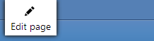
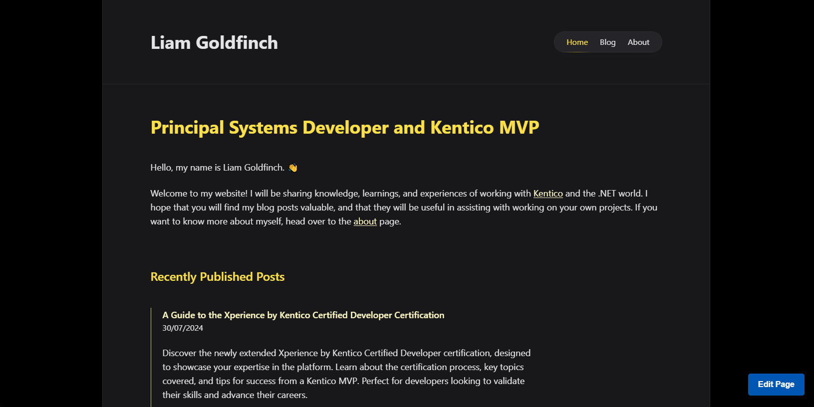

# Xperience Community: Page Edit Button

## Description

This package provides content editors with a button displayed on web channel pages, that allows them to quickly navigate to the right place in the Xperience by Kentico administration interface to edit the page.

**NOTE**: As mentioned in a [Q&A discussion](https://community.kentico.com/q-and-a/q/check-website-visitor-is-authenticated-in-admin-site-16a9ba36#answer_d001c14a11184f55babb1807bb48b5c5), this button will only appear if the user is authenticated to an admin portal that is on the **same domain** as the front-end site. For subdomain scenarios (e.g., `admin.domain.com` for admin and `www.domain.com` for the site), see the [Configuration](#configuration) section below.

In older versions of Kentico using Portal Engine (ASP.NET Web Forms), this functionality was provided through a button like this:



With this package, you can add a similar button to your Xperience by Kentico website channels. It will be displayed in the bottom right corner of the page:




## Library Version Matrix

| Xperience Version | Library Version |
| ----------------- | --------------- |
| >= 29.1.4         | 1.0.0+          |

## Dependencies

- [ASP.NET Core 8.0](https://dotnet.microsoft.com/en-us/download)
- [Xperience by Kentico](https://docs.xperience.io/xp/changelog)

## Package Installation

Add the package to your application using the .NET CLI

```powershell
dotnet add package XperienceCommunity.PageEditButton
```

## Quick Start

1. Install NuGet package above.

1. Add the following Tag Helper directive to your `_ViewImports.cshtml`:

   ```csharp
   @addTagHelper *, XperienceCommunity.PageEditButton
   ```
    
1. Add the `PageEditButton` ViewComponent and `page-edit-button-styles` Tag Helper to your layout template `_Layout.cshtml`:

   ```csharp
      <page-edit-button-styles />
   </head>
   <body>
      <vc:page-edit-button />
   ```    

1. Load a page after authenticating to the Xperience by Kentico administration interface. The button will appear in the bottom right corner of the page.

## Configuration

### Admin Domain Configuration (For Subdomain Scenarios)

If your Xperience administration interface is hosted on a **subdomain** (e.g., `admin.domain.com`) separate from your website channels (e.g., `www.domain.com`, `shop.domain.com`), you need to configure the admin domain so the edit button generates the correct URL.

**Example scenario:**
- Website channels: `www.domain.com`, `shop.domain.com`
- Admin interface: `admin.domain.com`

Without configuration, the button would incorrectly link to `https://www.domain.com/admin/...` instead of `https://admin.domain.com/admin/...`

**Important:** This configuration only works for **subdomains of the same root domain** (e.g., `admin.domain.com` and `www.domain.com`). This is because the button visibility depends on authentication cookies, which must be shared across the subdomains. For completely different domains, the authentication cookie will not be accessible and the button will not appear.

To share authentication cookies across subdomains, you must configure your authentication cookie domain in your application's authentication setup (e.g., setting the cookie domain to `.domain.com`).

#### Setup Instructions

1. Add the following configuration to your `appsettings.json`:

   ```json
   {
     "PageEditButtonOptions": {
       "AdminDomain": "admin.domain.com"
     }
   }
   ```

2. Register the options in your `Program.cs`:

   ```csharp
   using XperienceCommunity.PageEditButton.Options;

   var builder = WebApplication.CreateBuilder(args);

   // Register PageEditButton options
   builder.Services.Configure<PageEditButtonOptions>(
       builder.Configuration.GetSection("PageEditButtonOptions"));

   // ... rest of your configuration
   ```

3. The edit button will now generate absolute URLs pointing to your configured admin domain.

**Note:** If you don't configure an admin domain, the button will use relative URLs (current domain), which works fine for single-domain setups or when the admin is hosted at `/admin` on the same domain as your website channel.

## Contributing

Feel free to submit issues or pull requests to the repository, this is a community package and everyone is welcome to support.

## License

Distributed under the MIT License. See [`LICENSE.md`](LICENSE.md) for more information.